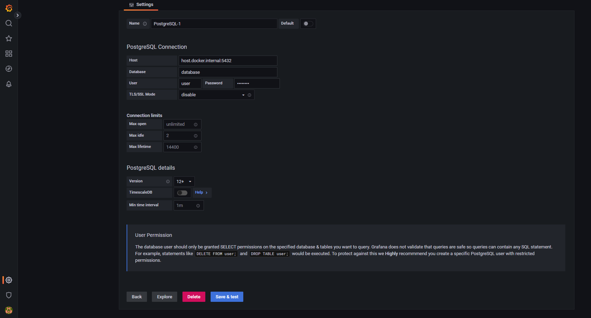

# Network Discovery with mDNS
An application to discover and monitor network nodes (which support mDNS implemented by Libp2p) in a LAN.


## Requirements

* `Golang 1.18` to build the program. (With the new Version of Golang 1.19 there are for the moment compatibility problem)
* `Docker` to start the containers for: PostgreSQL-Database (store the data) and Grafana (display the data with dashboards)

## Installation:

### Sender-Agent

The Sender-Agent discovers/connects to other hosts and collects metrics of the system. 

The ``sender.env`` doesn't need to be extra configured if you want to test the app.

Run the command ``go build`` inside the sender-agent folder to create an executable file:

``C:\Users\s.osman\Desktop\Discovery_mDNS\sender-agent> go build``

Run the exe file with:

``C:\Users\s.osman\Desktop\Discovery_mDNS\sender-agent> .\sender-agent.exe`` in Windows.

Or ``./sender-agent`` in Linux.

You will maybe be asked by your firewall to allow the app.

Now Run the sender-agent in another computer so that they find and connect to each other (another terminal in the same computer can be also used).


### DB-Agent

To store the data sent by the sender-agent, the db-agent has to be started:

The ``db.env`` file is already configured for the localhost.

Run the command ``docker-compose up -d`` inside the db-agent folder to start Postgres and Grafana in a container.

``C:\Users\s.osman\Desktop\Discovery_mDNS\db-agent> docker-compose up -d``

build an executable file with ``go build`` and run it as in the sender-agent.

In the terminal you will see all the message sent by the others agents. 

## Visualisation with Grafana

Now if you want to visualize the data stored and monitor the metrics go to http://localhost:3000


Enter ->  username: ``admin`` and password: ``admin``

Click on ``login`` -> ``skip`` if you don´t want to change the password.

In the Home go to ``Configuration`` -> ``Data source`` -> ``Add data source`` search for ``PostgreSQL`` and click on it.


* Copy the follow configuration:



The user, password and database name are the same used with Docker:
user: ``user``, password: ``password``, Database: `database`.

When you are done click on ``Save & Test``. The Database is now connected. 

* Back to the Home click on ``Dashboards`` -> new Dashboard :


-> Add a new panel


now select your created data source:


You are now able to see the tables and column from the Database. You can select the metrics you would like to monitor.

Here is an example for the monitoring of the latency, just paste the following code in the edit sql:

```
SELECT
  $__timeGroupAlias(time,$__interval),
  latency AS "latency",
  hostname AS "hostname",
  ip AS "ip",
  os AS "os",
  platform AS "platform",
  node_id AS "nodeID"
FROM system
WHERE
  $__timeFilter(time)
GROUP BY 1, hostname, latency, ip, node_id, os, platform
ORDER BY 1
```

You will see something like this:


Now click on apply and add another panel for the CPU with the follow sql code:

```
SELECT
  $__timeGroupAlias(time,$__interval),
  usage AS "CPU  USAGE",
  hostname AS "hostname",
  ip AS "ip",
  model AS "model",
  node_id AS "node"
FROM cpu
WHERE
  $__timeFilter(time)
GROUP BY 1, hostname, ip, model, usage, node_id
ORDER BY 1
```

and one for the TCP QUEUE:

```
SELECT
  $__timeGroupAlias(time,$__interval),
  queue_size AS "TCP QUEUE SIZE",
  hostname AS "hostname",
  ip AS "ip"
FROM tcp
WHERE
  $__timeFilter(time)
GROUP BY 1, hostname, ip, queue_size
ORDER BY 1
```

now Apply and Save the Dashboard.
